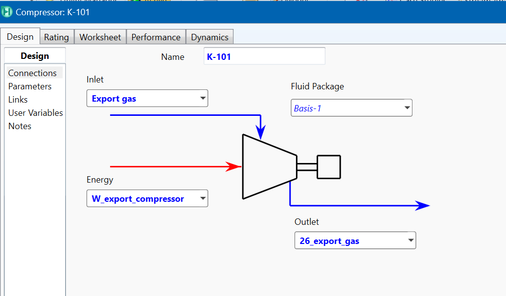
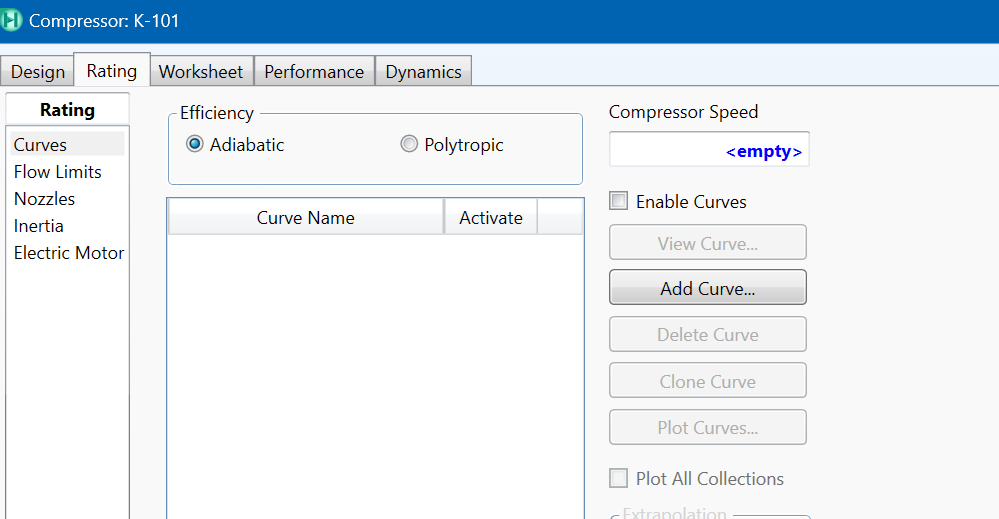
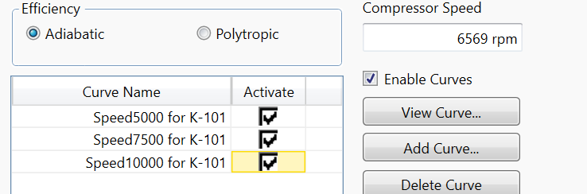

# Compressor Design using HYSYS

### What is compressor surge and stonewall?

### Difference between Adiabatic and Polytropic Efficiency

## Installing compressor in HYSYS
Dive deep into HYSYS. Let's build an Export Gas compressor together.

### 1. Add Compressor to Flowsheet
Drag and drop compressor to the flowsheet and define the inlet, outlet and energy streams:

### 2. Configure Compressor Curves
Head to the rating tab to add performance curves:

### Centrifugal Compressor Curve Data

#### At speed 5000 rpm
| Volume Flow (ACT_m3/h) | Head | Efficiency % |
|------------------------|------|--------------|
| 5800 | 9800 | 70 |
| 6200 | 9600 | 70.7 |
| 6600 | 9200 | 71.50 |
| 7000 | 8800 | 73 |
| 7400 | 8400 | 72.50 |
| 7800 | 7700 | 71.30 |
| 8200 | 7000 | 71 |
| 8600 | 6200 | 70.2 |

#### At speed 7500 rpm
| Volume Flow (ACT_m3/h) | Head (m) | Efficiency % |
|------------------------|----------|--------------|
| 8300 | 12000 | 69 |
| 8800 | 11800 | 68.50 |
| 9300 | 11400 | 70 |
| 9800 | 11000 | 71.3 |
| 10300 | 10600 | 72 |
| 10800 | 9900 | 71 |
| 11300 | 9200 | 70.5 |
| 11800 | 8400 | 68.9 |

#### At speed 10000 rpm
| Volume Flow (ACT_m3/h) | Head (m) | Efficiency % |
|------------------------|----------|--------------|
| 8700 | 14500 | 69.50 |
| 9200 | 14300 | 70.8 |
| 9700 | 13900 | 71.5 |
| 10200 | 13500 | 72.4 |
| 10700 | 13100 | 73.6 |
| 11200 | 12400 | 72.2 |
| 11700 | 11700 | 71.2 |
| 12200 | 10900 | 70.5 |

### 3. Configure Operating Conditions
After adding all curves, make sure that they are enabled. To operate your compressor, either you can define the desired output pressure or rotation per minute (rpm) or compressor duty. In this case, required output delivery pressure - 70 bars - is defined.

Eventually you can plot performance curves and check if your operation condition is within the acceptable range.